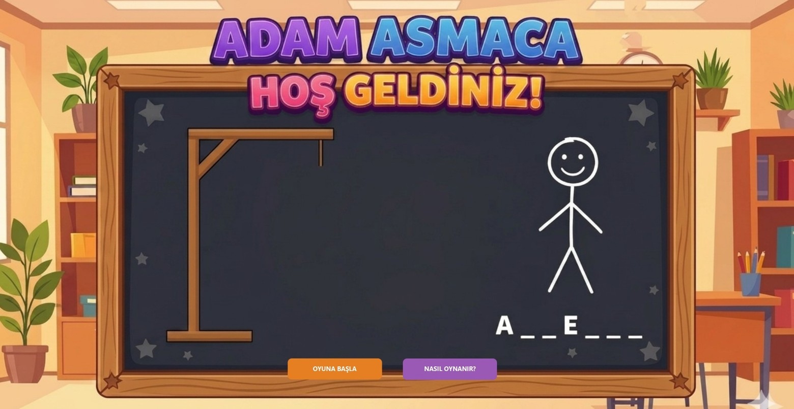
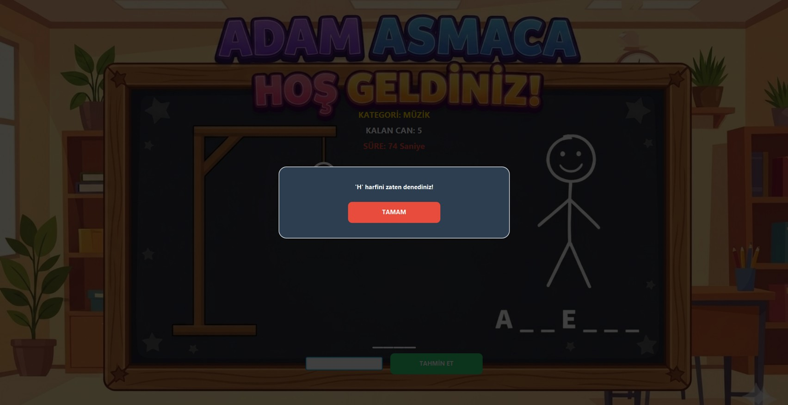
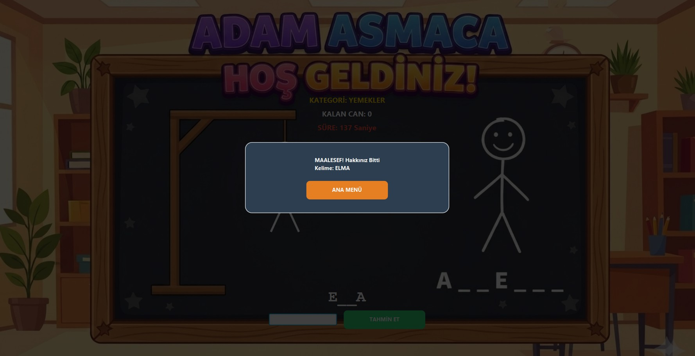

#  Adam Asmaca Oyunu (JavaFX)

Java ve JavaFX kullanılarak geliştirilmiş masaüstü Adam Asmaca oyunudur.

## Kullanılan Teknolojiler

* Java
* JavaFX
* Nesne Yönelimli Programlama (OOP)

## Özellikler

* Grafiksel kullanıcı arayüzü
* Rastgele kelime seçimi
* Harf tahmin sistemi
* Kullanılmış harf kontrolü
* Süre sistemi
* Kazanma ve kaybetme ekranları
* Çöp adam çizimi
* Yardım ekranı

##  Proje Yapısı

```text
Hangman-Game-Java
│
├── images
│   ├── game-over.png
│   ├── game-screen.png
│   ├── main-menu.png
│   └── used-letter.png
│
├── lib
│   ├── javafx.base.jar
│   ├── javafx.controls.jar
│   ├── javafx.fxml.jar
│   ├── javafx.graphics.jar
│   ├── javafx.media.jar
│   ├── javafx.swing.jar
│   ├── javafx.web.jar
│   └── javafx-swt.jar
│
├── arkaplan.jpg
├── Main.java
├── GameLogic.java
├── GameDialogs.java
├── HangmanPainter.java
│
└── README.md
```

## Ekran Görüntüleri

### Ana Menü



### Oyun Ekranı


### Kullanılmış Harf Uyarısı



### Oyun Sonu



## Çalıştırma

1. Java JDK 21 veya üzeri bir sürüm kurulu olmalıdır.
2. Proje bir Java IDE'si (VS Code, Eclipse, IntelliJ IDEA vb.) ile açılmalıdır.
3. `lib` klasöründeki JavaFX kütüphaneleri projeye eklenmelidir.
4. `Main.java` dosyası çalıştırılarak oyun başlatılabilir.

## Not

Bu proje JavaFX kullanılarak geliştirilmiştir.

Projeyi çalıştırabilmek için JavaFX kütüphanelerinin IDE içerisinde doğru şekilde tanımlanmış olması gerekmektedir.

Gerekli JavaFX dosyaları `lib` klasörü içerisinde bulunmaktadır.

Arka plan görselinin görüntülenebilmesi için `arkaplan.jpg` dosyasının proje dizininde bulunması gerekmektedir.


